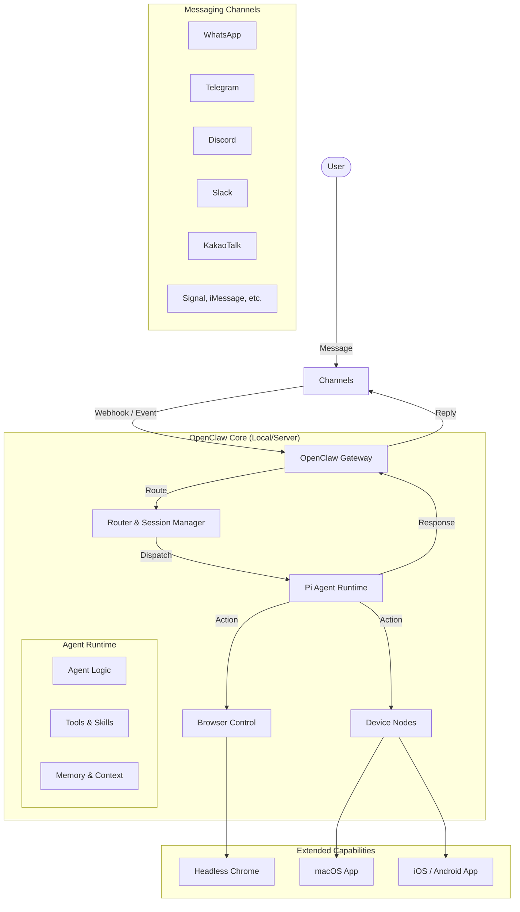

# 시스템 구성도 (System Structure)

## 1. 개요 (Overview)
OpenClaw는 사용자의 로컬 환경(Gateway)을 중심으로 다양한 메시징 채널과 AI 에이전트를 연결하는 **Local-first AI Assistant Platform**입니다.
이 문서는 시스템의 주요 구성 요소와 역할, 데이터 흐름을 상세하게 설명합니다.

## 2. 전체 아키텍처 다이어그램 (Architecture Diagram)

## 3. 주요 구성 요소 상세 (Key Components)

### 3.1. Gateway (제어 평면)
`src/gateway/`
시스템의 핵심으로, 모든 연결과 제어를 담당합니다.
- **Server (`server.ts`)**: WebSocket 및 HTTP 서버를 구동하여 클라이언트(UI, Nodes)와 통신합니다.
- **Router (`routing/`)**: 들어오는 메시지를 분석하여 적절한 에이전트(Session)로 라우팅합니다.
- **Auth (`auth.ts`)**: 접근 제어 및 인증을 담당합니다.
- **Config (`config/`)**: 시스템 설정을 관리합니다 (`~/.openclaw/openclaw.json`).

### 3.2. Channels (메시징 채널)
`src/channels/`, `extensions/`
외부 메시징 플랫폼과의 연동을 담당합니다.
- **Core Channels**: WhatsApp, Telegram, Discord, Slack 등 기본 내장 채널.
- **Extensions**: Zalo, Matrix 등 확장 가능한 플러그인 형태.
- **역할**: 플랫폼별 고유 이벤트를 OpenClaw 표준 `Activity` 포맷으로 변환(Inbound)하고, 에이전트의 응답을 다시 플랫폼별 포맷으로 변환(Outbound)합니다.

### 3.3. Agents (AI 에이전트)
`src/agents/`
실제 지능형 처리를 수행하는 에이전트 로직입니다.
- **Runtime (`pi-embedded-runner/`)**: LLM(Large Language Model)을 호출하고 컨텍스트를 관리합니다.
- **Tools (`pi-tools/`)**: 에이전트가 사용할 수 있는 도구(검색, 파일 조작 등)를 정의하고 실행합니다.
- **Session Manager**: 대화 세션 상태와 기록을 관리합니다.

### 3.4. Tools & Skills (도구 및 기술)
에이전트의 기능을 확장하는 모듈입니다.
- **Browser (`src/browser/`)**: CDP(Chrome DevTools Protocol)를 통해 브라우저를 직접 제어하고 웹을 탐색합니다.
- **Skills (`skills/`)**: 특정 작업을 수행하기 위한 도구 모음 (예: 날씨 조회, 주식 정보 등).
- **Bash Tools**: 시스템 쉘 명령을 실행합니다 (보안 샌드박스 내에서 실행 가능).

### 3.5. Nodes (디바이스 노드)
`src/node-host/`, `apps/`
물리적 디바이스와의 연동을 제공합니다.
- **macOS App**: 맥의 시스템 기능(알림, 앱 실행 등) 제어.
- **iOS/Android App**: 모바일 기기의 카메라, 위치 정보, 알림 기능 활용.
- **Canvas**: 에이전트가 그리는 실시간 UI 인터페이스.

## 4. 데이터 흐름 (Data Flow)
1. **수신**: 사용자가 카카오톡으로 메시지 전송 -> `extensions/kakaotalk` 수신 -> `Gateway` 전달.
2. **라우팅**: `Gateway`가 세션 확인 -> `Router`가 해당 사용자의 에이전트 세션으로 메시지 배정.
3. **처리**: `Agent Runtime`이 메시지와 컨텍스트를 LLM에 전달 -> LLM이 추론.
4. **도구 실행 (옵션)**: LLM이 도구 사용 요청 -> `Tools` 실행 -> 결과 반환.
5. **응답**: LLM이 최종 답변 생성 -> `Gateway` -> `extensions/kakaotalk` -> 사용자에게 전송.
